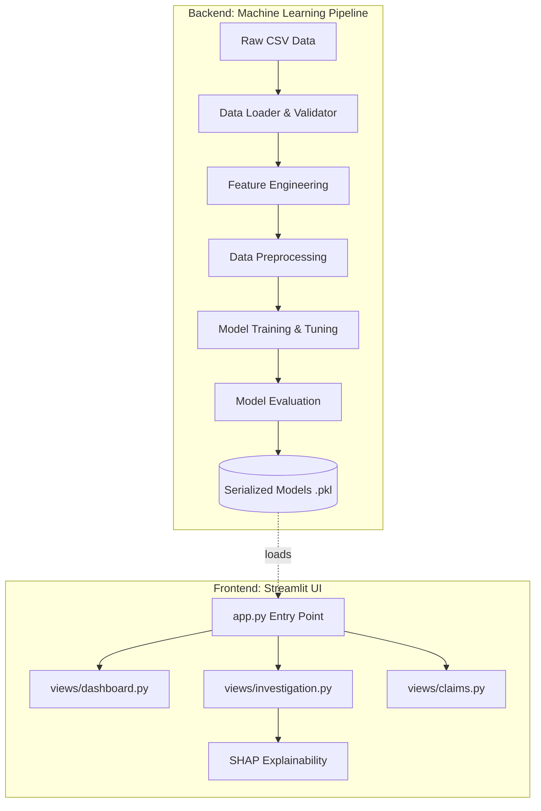

# ClaimShield AI: System Architecture & Codebase

This document serves as the foundational guide to understanding the ClaimShield AI repository structure, the underlying technical architecture, and the request lifecycle. It is designed to equip you with the knowledge needed to explain the system at a granular engineering level.

---

## 1. High-Level Architecture

ClaimShield AI is divided into two decoupled systems:
1.  **The Backend Machine Learning Pipeline (`src/` & `run_pipeline.py`)**: Responsible for ingesting raw data, cleaning it, training models, evaluating them, and serializing (saving) the final trained models as artifacts.
2.  **The Frontend Streamlit Application (`app.py` & `views/`)**: A dynamic Python web server that loads the serialized models, accepts user input, and renders interactive data visualizations and predictions.



---

## 2. Directory Structure Deep Dive

The repository enforces a strict separation of concerns, heavily influenced by best practices in MLOps and software engineering (such as the Cookiecutter Data Science template).

```text
claimshield/
│
├── app.py                     # The main Streamlit entry point. Manages session state and routing.
├── run_pipeline.py            # The execution script for the entire ML backend.
├── requirements.txt           # Defines all Python package dependencies.
│
├── data/                      # Data storage layer (Ignored by git if containing sensitive PII)
│   ├── raw/                   # Immutable raw datasets.
│   ├── processed/             # Cleaned datasets ready for model ingestion.
│   └── sample/                # Sample datasets used for UI demonstration.
│
├── docs/                      # Technical documentation suite (You are here).
│
├── models/                    # Model artifact storage.
│   └── saved/                 # Serialized .pkl files (e.g., xgboost_model.pkl, scaler.pkl).
│
├── src/                       # The core backend Python package.
│   ├── data/                  # Modules for loading (loader.py) and validating (validator.py).
│   ├── features/              # Modules for feature creation (engineering.py) and cleaning (preprocessor.py).
│   ├── models/                # Modules defining training logic (train.py), evaluation (evaluate.py), and XAI (explain.py).
│   └── risk/                  # Business logic mapping probabilities to actions (decision.py).
│
└── views/                     # Frontend UI modules dynamically loaded by app.py.
    ├── dashboard.py           # High-level aggregate metrics.
    ├── investigation.py       # Deep-dive into specific claims using SHAP.
    ├── claims.py              # Filterable queue of all scored claims.
    └── model_performance.py   # Technical metrics and ROC/PR curves.
```

---

## 3. Frontend Execution Flow (Streamlit)

When the application is launched via `streamlit run app.py`, the following sequence occurs:

1.  **Global Initialization:** `app.py` executes from top to bottom. It first defines the global CSS (setting up our custom Corporate Minimalist theme, typography, and color variables like `--background` and `--primary`).
2.  **State Management:** Streamlit runs procedurally. We use `st.session_state` to track variables across page reloads. In `app.py`, we initialize `st.session_state.current_view`.
3.  **Dynamic Routing:** We bypassed Streamlit's native multi-page functionality (which relies on a `pages/` directory and auto-generates a sidebar we couldn't fully style). Instead, we created a custom sidebar in `app.py`.
4.  **View Rendering via `importlib`:** When a user clicks a button in the custom sidebar, `st.session_state.current_view` updates. We then use Python's `importlib.import_module(f"views.{current_view}")` to dynamically load the corresponding python file from the `views/` directory and execute its `render()` function.

```python
# Conceptual Example of Dynamic Routing in app.py
current_page = st.session_state.current_view
module = importlib.import_module(f"views.{current_page}")
module.render()
```

### Why this architecture?
By decoupling the views into separate modules rather than writing one massive `app.py` file, we ensure the codebase remains maintainable, modular, and highly scalable. If we need to add a new "Settings" page, we simply add `settings.py` to the `views/` directory and update the sidebar navigation list.
